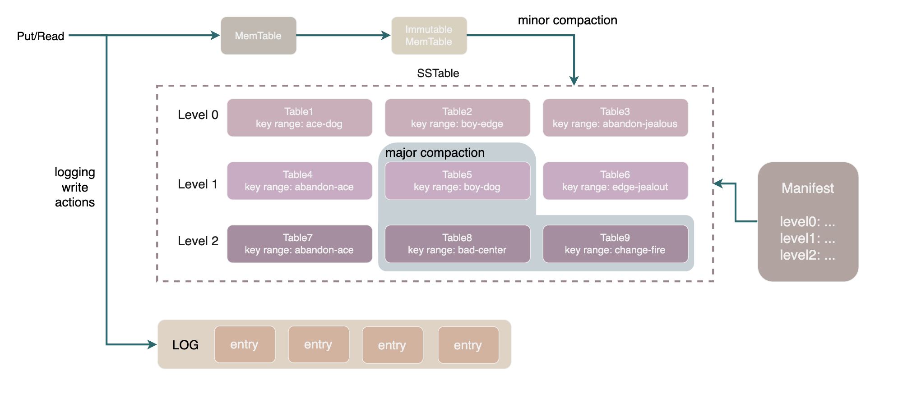

LevelDB 是 Google 开发的一款经典的 Key-Value 数据库。它的代码简洁优雅，非常适合作为学习数据库的阅读材料。

LevelDB 使用 LSM-Tree 结构，利用硬盘顺序写远远快于随机写的特点，来实现极高的写入性能。

由于许多机制需要分散在各处的代码互相配合才能实现，为了便于理解我们编写了一系列文章(并画了一大堆图)进行归纳梳理，以期为读者提供一个宏观的视角：

- [01-概论](./articles/01-introduction.md)
- [02-工具类](./articles/02-utils.md)
- [03-MemoryTable](./articles/03-MemTable.md)
- [04-预写日志格式及读写流程](./articles/04-Log.md)
- [05-SSTable格式](./articles/05-SSTable.md)
- [06-SSTable构造流程](./articles/06-SSTableBuilder.md)
- [07-写入流程](./articles/07-WriteProcess.md)
- [08-MinorCompaction](./articles/08-MinorCompaction.md)
- [09-元数据管理Manifest](./articles/09-Manifest.md)
- [10-MajorCompaction](./articles/10-MajorCompaction.md)

已经注释或介绍过的的源文件:

|源文件|功能介绍|相关文章|
|:-:|:-:|:-:|
|[include/leveldb/db.h](./include/leveldb/db.h) | leveldb 对外暴露的接口 | |
|[db/db_impl.cc](./db/db_impl.cc)| leveldb 的核心逻辑 | 从 [07-写入流程](./articles/07-WriteProcess.md) 开始， 后面的文章都与它相关|
|[slice.h](./include/leveldb/slice.h) | 字符串类 | [02-工具类](./articles/02-utils.md) |
|[util/coding.h](./util/coding.h)| varint 和 fixedint 等编码 | [02-工具类](./articles/02-utils.md) |
|[arena.h](./util/arena.h) / [arena.cc](./util/arena.cc)|一种简单高效的内存管理方式| [02-工具类](./articles/02-utils.md) |
|[memtable.h](./db/memtable.h)/[memtable.cc](./db/memtable.cc)| 内存中的有序表 | [03-MemoryTable](./articles/03-MemTable.md) | 
|[skiplist.h](./db/skiplist.h)| MemTable 底层的跳表实现 | [03-MemoryTable](./articles/03-MemTable.md)  |
|[log_writter.cc](./db/log_writer.cc) | 预写日志的写入 | [04-预写日志格式及读写流程](./articles/04-Log.md) |
|[log_reader.cc](./db/log_reader.cc)| 预写日志的读取 | [04-预写日志格式及读写流程](./articles/04-Log.md) |
| [table_builder.h](./table/table_builder.h) / [table_builder.cc](./table/table_builder.cc)| sstable 构造器 | [06-SSTable构造流程](./articles/06-SSTableBuilder.md) |
|[block_builder.h](../table/block_builder.h) / [block_builder.cc](../table/block_builder.cc)| sstable 中块（block）的构造流程 | [06-SSTable构造流程](./articles/06-SSTableBuilder.md) |
|[filter_block.cc](./table/filter_block.cc)| filterBlock 用于快速判断sstable中是否包含某个 key | [06-SSTable构造流程](./articles/06-SSTableBuilder.md) |
|[WriteBatch.h](./include/write_batch.h)/[WriteBatch.cc](./db/write_batch.cc)| 写事务数据结构 | [07-写入流程](./articles/07-WriteProcess.md) |
|[version_set.h](./db/version_set.h) / [version_set.cc](./db/version_set.cc)| 维护各层 sstable 的元数据 | [09-元数据管理Manifest](./articles/09-Manifest.md) | 
|[version_edit.h](./db/version_edit.h) / [version_edit.cc](./db/version_edit.cc)| version_edit 是一次元数据变更 | [09-元数据管理Manifest](./articles/09-Manifest.md) | 

## 关于提交 PR 的方法：
### Step1:
首先你需要 fork 本仓库到你自己的 github 仓库，点击右上角的 fork 按钮🎉🎉 
### Step2:
使用 git clone 命令将本仓库拷贝到你的本地文件，git clone 地址请点开项目上方的绿色 "code" 按钮查看😀😀 
### Step3:
在你的本地对代码进行一番精心修改吧！🍉🍉 
### Step4:
修改完后，是时候该上传你的改动到你 fork 来的远程仓库上了。你可以用 git bash，也可以使用 IDE 里的 git 来操作。对于 git 不熟的用户建议使用 IDE，IDE 也更方便写 commit 信息，别忘了写 commit 信息哦！当然我们只是增删改中文注释，如果要直接在 github 上编辑也可以，你可以使用最简单的在线编辑功能（预览文件的时候点击右上角的笔🖊），或者你也可以在你的仓库首页按一下句号键使用 github 提供的在线 vscode 。🤔🤔 
### Step5:
上传之后，点进你的仓库主页，会出现一个 "Contribute"，点击它，选择 "Open pull request"，选择好你仓库的分支和你想要在这里合并的分支后，点击 "Create pull request"，之后填写你的 PR 标题和正文内容，就成功提交一个 PR 啦！🍭🍭
### Step6 (optional):
记得检查修改自己的 GitHub Public profile 里的 Name 和 Public email，位置在右上角头像的 Settings 里，因为大多数情况下我们会使用 squash merge 来合并 PRs，此时 squash merge 后产生的新提交作者信息会使用这个 GH 信息（如果你的信息想公开的话）。

## 关于提交 PR 的内容：

### 修改内容：
1. 给未有中文注释的函数添加中文注释。
2. 修改本仓库中的文章或者添加新的文章
3. 修改或删除意思不明确的，意思有误的，有错别字的中文注释。
4. 修改不标准的注释格式，修改比较严重的标点错误(中文字用英文逗号、句号、括号、引号实际上不需要修改）。
5. 给中文注释不足的函数添加注释。
   
### 注释格式：

1. **请使用 UTF-8 编码进行注释。**
2. 英文和中文之间要有一个空格。
3. 注释里的文字内容与注释符号之间有一个空格
