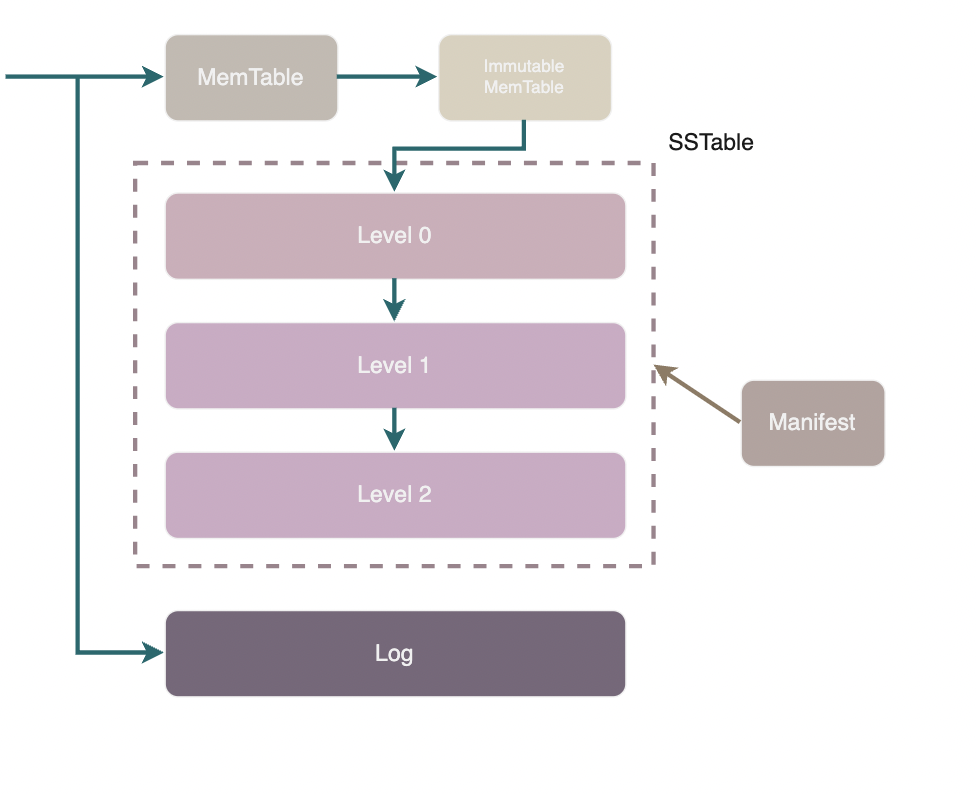
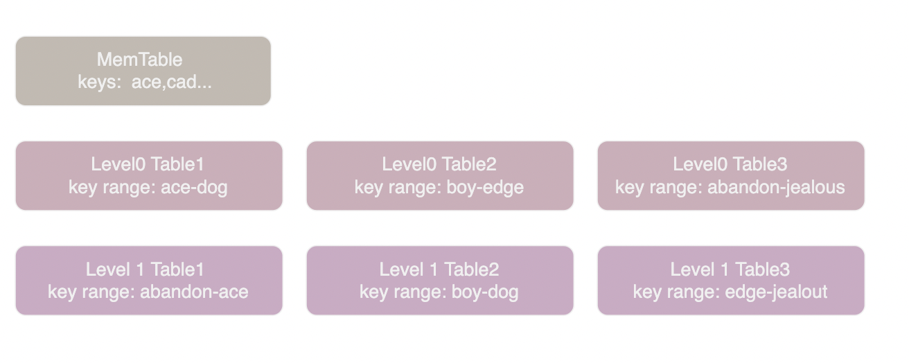

leveldb 是一个非常经典的基于 LSM 树(Log Structured-Merge Tree)实现的 KV 数据库。LSM 的核心思想是使用顺序写代替随机写，牺牲部分读取能力换取写入能力。

## 组件

我们在 leveldb 中需要注意几个重要组件：

- memtable
- immutable memtable
- Log (Write Ahead Logging)
- sstable
- Manifest
- Current

如上图所示，leveldb 中始终有一个 memtable，最多存在一个 immutable memtable，磁盘上还有若干 sstable 分层进行管理。此外会有若干个 Manifest 文件和一个 Current 文件负责维护 leveldb 的元信息，具体来说就是各个 sstable 的信息。

memtable 是一个内存中的有序 map 结构，它的底层实现是一个跳表。在进行写入时，总是首先会写入 memtable，当 memtable 的大小达到阈值(4MB)时，memtable 会被转变为不可写入的 immutable memtable。随后 leveldb 的后台线程会将 immutable memtable 的内容转换为 sstable 格式持久化到磁盘上。

sstable (Sorted String Table) 是负责将键值对持久化存储在磁盘上的结构，键值对在table 文件中按照字典序有序排列，故而命名为 Sorted String。此外，sstable 中也包含了一些索引数据以便于查询。sstable 一旦创建便不可修改，不可变的设计极大地简化实现并行操作的复杂度。

leveldb 在修改或删除数据时会直接在 memtable 中写入新版本的数据，并等待 memtable 变为 immutable memtable 然后落盘形成新的 sstable。相对的，在读取时则需要依次搜索 memtable、immutable memtable 以及各个 sstable 直到找到 key 的最新版本。

MANIFEST 文件就是用来管理 leveldb 中的 sstable 的，它记录了每层有哪些 sstable、每个 sstable 的 key range 等信息。

leveldb 的写入机制很可能导致多个 sstable 中包含同一个 Key 的不同版本，而其中比较陈旧的版本不会被读取到，只是在白白浪费磁盘空间。因此 leveldb 在必要时会进行合并操作将 sstable 中过旧的版本删除。这个合并操作被称为 Merge 或 Compaction, 它是 leveldb 的核心逻辑之一，我们将会在后面详细进行分析。

每次合并都会删除若干 sstable 并产生若干新的 sstable, leveldb 在每次合并后都会产生一个新的 MANIFEST 文件，而 CURRENT 文件只记录一个信息，就是最新的 MANIFEST 文件名，便于 leveldb 重启时正确加载数据。

上文中提到 leveldb 的写操作并不是直接写入磁盘的，而是首先写入到内存中的 memtable 。假设写入到内存的数据还未来得及持久化，leveldb 崩溃抑或是宿主机器发生了宕机则会造成用户的写入发生丢失。因此 leveldb 在写内存之前会首先将所有的写操作写到 log 文件(这种 log 通常被称为 Write Ahead Logging, WAL)中，在出现异常后根据 log 文件进行恢复。

> 在我们后续的文章和 leveldb 的注释中，log 通常特指 WAL 而不是通常的用于 debug 的文本日志。

> leveldb 自带的注释中 File 通常特指 sstable

## sstable 的分层管理

我们回过头再来看一下 leveldb 的写入流程可以发现，由 memtable 持久化得到的 sstable 之间没有任何关系，键值对分布在哪个 sstable 上是完全随机的。

如果不进行优化，我们需要逐个 sstable 进行搜索才能找到我们需要的 key。最坏的情况是我们必须搜索每一个 sstable 才能确定要找的 key 不存在。

为了解决这个问题，leveldb 将 sstable 分成多层（level）进行管理。immutable memtable 持久化产生的文件存储在 level0。当 level 0 中的文件过多时，leveldb 便会将多个 level0 的 table 合并为一个 table 放入 level1。类似地当 level1 中数据过多时，便会将若干个 level1 的 table 进行合并然后放入 level2。

除了 level0 之外其它层中的 sstable 是有序排列且不重叠的，在读取时每层最多需要进入一个 sstable 进行搜索。

如上图所示，Level0 Table1 中 key 的范围是 "ace" 到 "dog", Level0 Table2 中 key 的范围是 "boy" 到 "edge", 如果我们在 level0 中搜索 "cat" 首先要搜索 Table1, 如果 Table1 中没有找到则需要再搜索 Table2。也就是说我们需要搜索每一个 key range 中包含 "cat" 的 table。

如果我们在 Level1 中搜索 "cat" 只需要搜索 Table2, 因为 Level1 中 table 的 key range 不重叠，所以其它 table 的 key range 中不可能包含 "cat"。

为什么 Level0 中 sstable 不能避免重叠呢？因为避免重叠需要将 table 读入、合并后重新存盘，这显然是非常耗时的操作。但是由于内存有限我们必须尽快将 memtable 存盘腾出空间来给新的 memtable(实际上 memtable 持久化会阻塞写入操作)。所以 level0 采用了最快速的方法：不进行 merge 操作直接持久化 memtable。