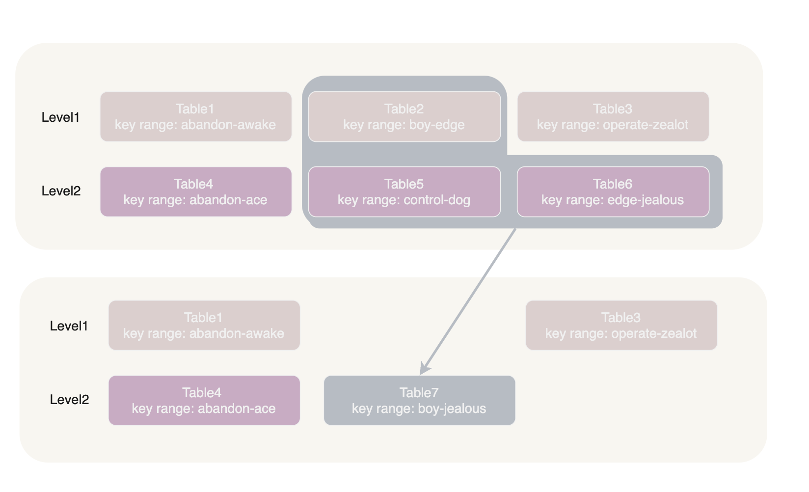
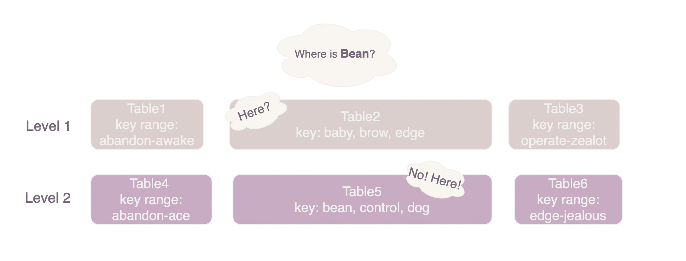
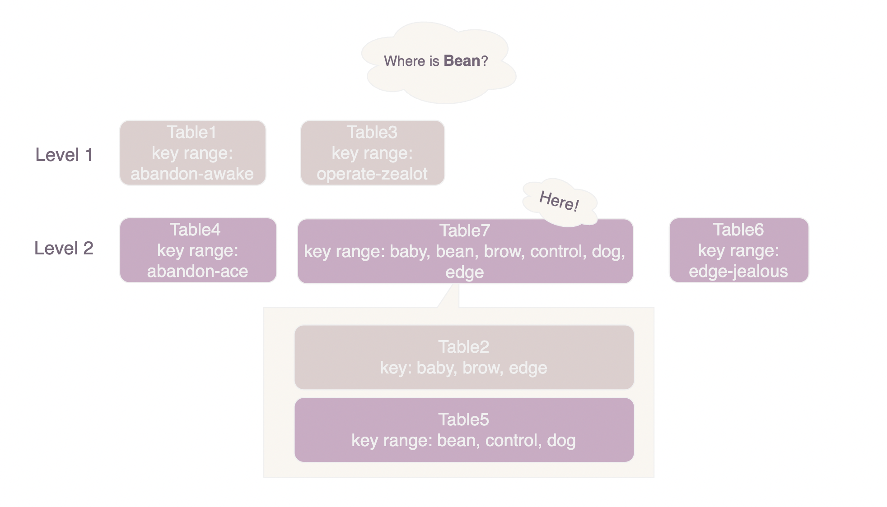
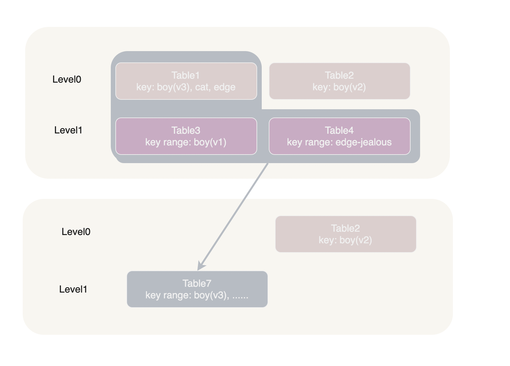
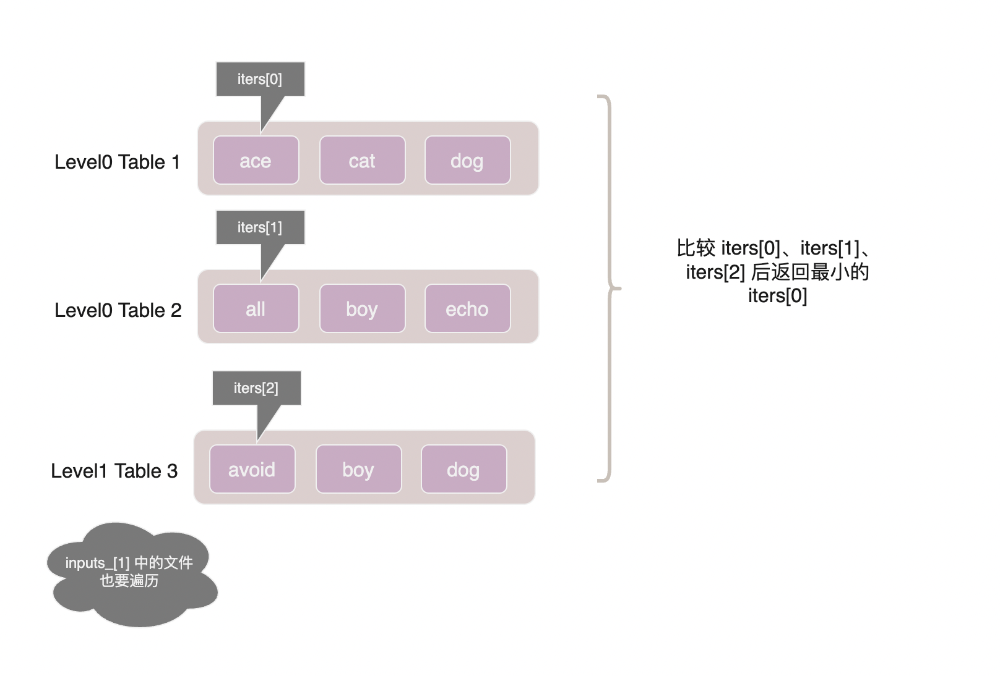
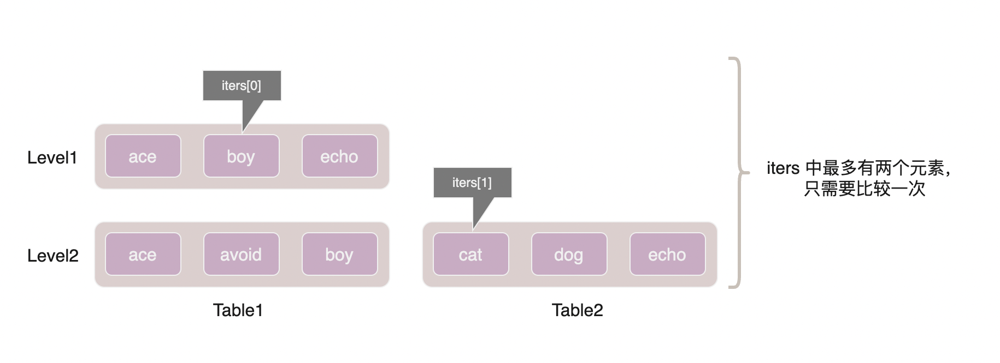

MajorCompaction 是指将 sstable 合并、沉入更下层的操作，它也是 leveldb 中最为关键的流程。
经过 MajorCompaction 的整理，无用的旧版本数据会被删除以节省磁盘空间，sstable 数量也会减少从而提高查询的效率。



在图中所示这次 compaction 中，level1 的 table2 与 level2 的 table5 和 table6 有重叠部分，这三个 table 会在 major compaction 中被合并为一个新的 table7 放入 level2 中。

## MajorCompaction的触发

MajorCompaction 触发时机有三种：

- level0 中文件数太多或更深层的 sstable 字节数过大
- 某个 sstable 的 seek 次数过多
- 使用者通过 CompactRange 函数手动触发

由文件数过多或字节数过大触发的 Compaction 在源码中被称为 size compaction, 由 seek 次数过多触发的 Compaction 被称为 seek compcation.

### size compaction

在 Manifest 的介绍中我们提到过，leveldb 在每次保存新的 sstable 文件后调用 VersionSet::LogAndApply 函数来向 Manifest 提交变更。而 LogAndApply 函数则会调用 VersionSet::Finalize 函数来评估是否需要下一次 size compaction.

> 这几个函数都在 [version_set.cc](../db/version_set.cc) 中。

Finalize 函数对于 level0 会用文件数除以4得到分数，其它层用总字节数除以阈值得到分数。然后将得分最高的层级及其分数存储在 VersionSet 对象的 compaction_level_ 和 compaction_score_ 字段中。

```cpp
 if (level == 0) {   
    score = v->files_[level].size() /
            static_cast<double>(config::kL0_CompactionTrigger);
} else {
    const uint64_t level_bytes = TotalFileSize(v->files_[level]);
    score =
        static_cast<double>(level_bytes) / MaxBytesForLevel(options_, level);
}
```

原作者 davidsgrogan 还在注释中解释了为什么了 level0 根据文件数判定而不是字节数判定。不过我没有看懂，哪位看懂了记得给我说一声。

```
// We treat level-0 specially by bounding the number of files
// instead of number of bytes for two reasons:
//
// (1) With larger write-buffer sizes, it is nice not to do too
// many level-0 compactions.
//
// (2) The files in level-0 are merged on every read and
// therefore we wish to avoid too many files when the individual
// file size is small (perhaps because of a small write-buffer
// setting, or very high compression ratios, or lots of
// overwrites/deletions).
```

### seek compaction

在研究 seek compaction 的触发机制前，我们需要先知道为什么我们需要 seek compaction.

如下图所示，虽然 Level1 的 Table1 的 key-range（从baby到edge）覆盖了 "bean", 但是文件中并没有包含 "bean"。在查找时 leveldb 会打开 table1 搜索 "bean" 但是找不到，需要继续搜索下一层的 table5。



这种 key range 覆盖某个 key 但实际上文件中却不包含这个 key 的情况被称为 seek miss。seek miss 现象无疑拖慢了查询效率，为了减少它发生的概率 leveldb 会将 seek miss 次数过多的表合并到下一层， 即我们本节讨论的 seek compaction.



如上图所示，将 Table2 和 Table5 合并为 Table7 之后，只需要打开一个 sstable 就可以找到 "bean" 了。

那么 seek compaction 触发机制具体是如何实现的呢？

leveldb 在保存 sstable 元信息的 FileMetaData 结构体中引入了 allowed_seeks 字段，该字段初始为文件大小与16KB的比值，不足100则取100。

负责读请求 DBImpl::Get 函数在每次读取完成之后都会调用 current version 的 UpdateStats 函数来更新 FileMetaData。每发生一次 seek miss 都会让 allowed_seeks - 1，当 allowed_seeks 为 0 后则会将 current version 的 file_to_compact_ 字段指向当前文件，以此通知后台线程此文件需要 SeekCompaction。

> Version::UpdateStats 函数在 [version_set.cc](../db/version_set.cc) 中

## MajorCompaction 过程

### PickCompaction

在 leveldb 中 MajorCompaction 操作由 [db_impl.cc](../db/db_impl.cc) 中的 BackgroundCompaction 函数在后台线程执行。

BackgroundCompaction 做的第一件事是检查是否需要 compaction, 它首先会通过 current version 的 CompactRange 检查是否用户手动发出的 compaction 命令，如果没有用户命令则通过 versions_->PickCompaction() 来检查是否需要 size compaction 或 seek compaction。

```cpp
Compaction* VersionSet::PickCompaction() {
    int level;
    Compaction* c;
    const bool size_compaction = (current_->compaction_score_ >= 1);
    const bool seek_compaction = (current_->file_to_compact_ != nullptr);
    if (size_compaction) {
        level = current_->compaction_level_;
        c = new Compaction(options_, level);
        if () {
            // 这里省略了一些 compact_pointer_ 有关的逻辑
        } else {
            c->inputs_[0].push_back(current_->files_[level][0]); // 注意看，这里只塞进去了一个
        }
    } else if (seek_compaction) {
        level = current_->file_to_compact_level_;
        c = new Compaction(options_, level);
        c->inputs_[0].push_back(current_->file_to_compact_); // 这里也只塞进去了一个
    }else{
        return nullptr;
    }
    if (level == 0) { /*something special */ }
    // 找到下一层中与 c.inputs_[0] 有重合部分的文件，把它们放到 inputs_[1] 中
    SetupOtherInputs(c);
    return c;
}
```

PickCompaction 会通过我们在触发机制一节中提到的 current version 的 compaction_score_ 和 file_to_compact_ 字段来进行判断，并优先进行 size compaction。

在确定需要 compaction 后 PickCompaction 会返回一个 Compaction 对象，Compaction 对象中包含两个重要字段: level_ 和 inputs_。

level_ 表示此次 compaction 开始的层级，比如我们要把 level0 中的若干文件合并到 level1, 那么 level_ 字段的值便为 0，类似地 level1 合并到 level2 时 level_ 为 1.

inputs_ 字段是个长度为2的二维数组，inputs_[0] 和 inputs_[1] 分别对应了参与 compaction 的两个层级。


在图中所示这次 compaction 中，level_ 为 1，inputs_[0] 为 table2, inputs_[1] 为 table5 和 table6 。

#### level0

除了 level0 之外，其它层级的 sstable 之间是互不重叠的，因此在一次合并过程中 inputs_[0] 只有一个文件。但在 level0 中这么做就会出现问题。



如上图所示，level0 的 table1 与 level1 的 table3、table4 合并后生成了新的 table7。"boy" 在合并前出现了 v1, v2, v3 三个版本，合并后最新的 v3 处于 level1 而较旧的 v2 却在 level0。在后续查询 "boy" 时得到的结果就不是正确的 v3 而是旧版本 v2。

为了避免这种错误，我们需要将 level0 中所有与 inputs_[0][0] 有重叠部分的 table 全部纳入到 compaction 中来。


PickCompaction 有一小段逻辑处理这种情况：

```cpp
if (level == 0) {
    // 计算 inputs_[0] 中的所有 table 的 key range(虽然里面只有一个 table)
    InternalKey smallest, largest;
    GetRange(c->inputs_[0], &smallest, &largest); 
    // 找到 level0 中所有与 [smallest, largest] 有交集的的文件，结果存入 c->inputs_[0] 中
    current_->GetOverlappingInputs(0, &smallest, &largest, &c->inputs_[0]);
    assert(!c->inputs_[0].empty());
}
```

#### compact_pointer_

有些同学可能已经注意到，在 PickCompaction 的 size compaction 部分中我们省略了一部分与 compact_pointer_ 有关的逻辑。那么 compact_pointer_ 是用来做什么的呢？

compact_pointer_ 是一个长度与层级数相同的数组，其中记录了每层上一次 compaction 进行到了哪个文件。下次 compaction 时则会从未压缩的文件开始。

```cpp
// 遍历 level 层所有 table, 找到 compact_pointer_[level] 后面一个
for (size_t i = 0; i < current_->files_[level].size(); i++) {
    FileMetaData* f = current_->files_[level][i];
    if (compact_pointer_[level].empty() ||
        icmp_.Compare(f->largest.Encode(), compact_pointer_[level]) > 0) {
    c->inputs_[0].push_back(f);
    break;
    }
}
// 如果层内所有文件都小于 compact_pointer_ 则从第一个 table 开始
if (c->inputs_[0].empty()) {
    // Wrap-around to the beginning of the key space
    c->inputs_[0].push_back(current_->files_[level][0]);
}
```

### DoCompactionWork

在完成 PickCompaction 之后，BackgroundCompaction 函数会将它返回的 compaction 传给 DoCompactionWork 开始真正的 MajorCompaction 过程。

```cpp
CompactionState* compact = new CompactionState(c);
status = DoCompactionWork(compact);
```

leveldb 支持 MVCC 机制，每个读事务在开始时都会根据当时的 SequenceNumber 创建一个快照, 如果一个 entry 不是它 user key 的最新版本且它的序列号小于所有快照，那么它已经不可访问，可以放心清除。 DoCompactionWork 要做的一件事就是确定哪个序列号之前的数据可以安全的删除。

```cpp
if (snapshots_.empty()) {
    // 没有运行中的读事务，用当前序列号
    compact->smallest_snapshot = versions_->LastSequence();
  } else {
    compact->smallest_snapshot = snapshots_.oldest()->sequence_number();
  }
```

DoCompactionWork 的整体流程并不难理解：

```cpp
Status DBImpl::DoCompactionWork(CompactionState* compact) {
    // input 会按照 InternalKeyComparator 的顺序返回 compact.inputs_ 中的 entry
    // 即按照 UserKey 升序，相同 UserKey 则按 SequenceNumber 降序排列
    Iterator* input = versions_->MakeInputIterator(compact->compaction);

    std::string current_user_key;
    SequenceNumber last_sequence_for_key = kMaxSequenceNumber; // current_user_key 的最新序列号
    while (input->Valid()) {
        // 如果有 immutable memtable， 优先保存 immutable memtable
        if (has_imm_.load(std::memory_order_relaxed)) {}

        Slice key = input->key();
        //  如果目前 compact 生成的文件会导致接下来 level + 1 与 level + 2 层 compact 压力过大，那么结束本次 compact.
        if (compact->compaction->ShouldStopBefore(key)) {}

        // 决定是否要保留当前 entry
        bool drop = false;
        ParseInternalKey(key, &ikey); // 解析 input->key() 结果存储到 ikey
        if (!has_current_user_key || current_user_key != ikey.user_key) {
            // ikey.user_key 第一次出现，保留
            current_user_key = ikey.user_key;
            last_sequence_for_key = ikey.sequence; // 这里和源代码的写法不太一样，但是效果相同，而且更好理解
        } else if (last_sequence_for_key <= smallest_snapshot) {
            // 当前 entry 已无快照可以访问，drop it
            drop = true;
        } else if (key.type == kTypeDeletion &&
                    ikey.sequence <= compact->smallest_snapshot &&
                    compact->compaction->IsBaseLevelForKey(ikey.user_key)) {
            // 这个分支的条件不是很好懂
            // 它的意思是，如果当前 entry 标识 key 已被删除，且这个 user key 在更深层也没有出现过
            // 那么，这个删除标记本身也不需要了，
            drop = true;
        }
        
        if (!drop) {
            // 打开 table builder 写数据，懂的都懂
            if (compact->builder == nullptr) {
                OpenCompactionOutputFile(compact);
            }
            compact->builder->Add(key, input->value());
        }
    }

    FinishCompactionOutputFile(compact, input); // 关闭table builder 以及 fsync 等操作
    InstallCompactionResults(compact); // 提交 sstable 变更，即更新 VersionSet 和 Manifest 文件
}
```

到目前为止 MajorCompaction 代码中只剩下 InputIterator 没有分析了，在上面的注释中我们已经了解到 input 会按照 InternalKeyComparator 的顺序返回 compact.inputs_ 中的 entry， 即按照 UserKey 升序，相同 UserKey 则按 SequenceNumber 降序排列。

根据 inputs_[0] 是否为 level0, InputIterator 有两种实现。对于 level0 没有好办法，只能每个 table 打开一个 iterator 然后逐个比较谁是下一个：



对于其他层级来说，由于层内有序完全可以避免层内比较：



能够跨越多个 table 的 iters[1] 是一个 TwoLevelIterator。它是一个 Iterator 的数组，其中每个元素便是一个 table 的迭代器, 当遍历完第一个 table 的迭代器后便会自动开始遍历第二个 table 的迭代器。