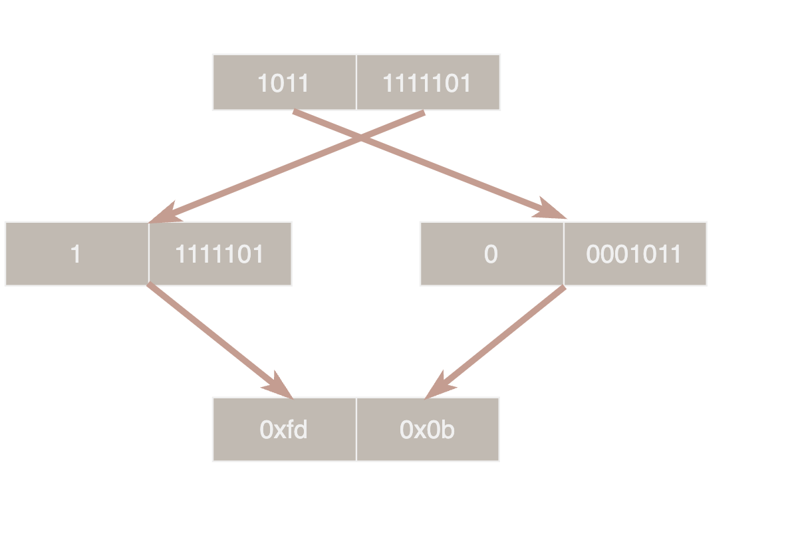
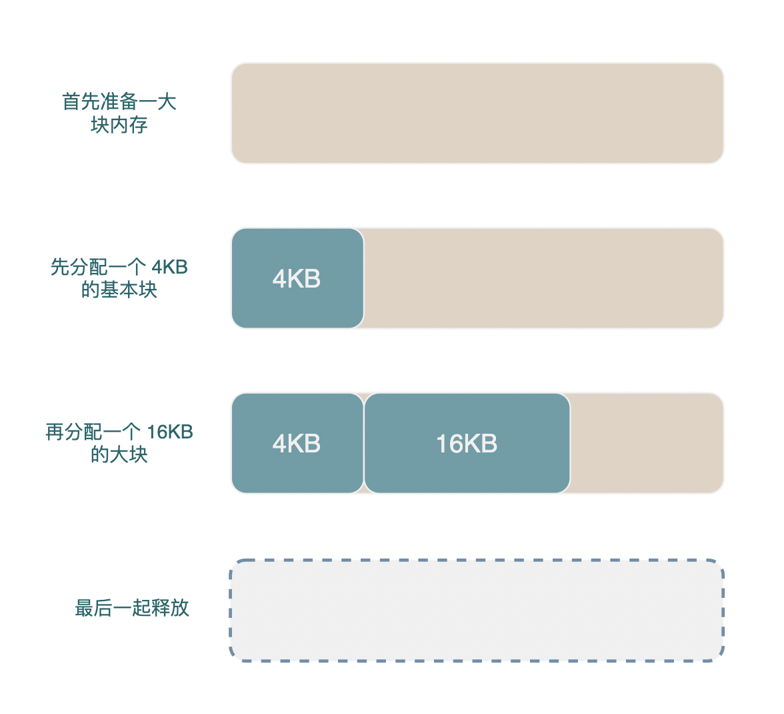

在开始正式探究 leveldb 源码之前，我们先来介绍一下 leveldb 中几个重要的工具类。

## Slice

[Slice](../include/leveldb/slice.h) 是 leveldb 中的字符串类型, 它由一个指针和一个 size_ 字段。

通常 Slice 自己不持有内存，而是指向各类 buffer 中的数据。

## Varint

Varint 是一种常用的变长整型编码方式，varint 中每个字节的最高位为 1 表示下一个字节仍有数据，0 表示已经是最后一个字节，剩下的 7 位用于存储数据。

```cpp
// 编码后的数据存储在参数 dst 和返回的 ptr 两个指针中间(左闭右开，不包含 ptr 指向的字节)
char* EncodeVarint32(char* dst, uint32_t v) {
    uint8_t* ptr = reinterpret_cast<uint8_t*>(dst);
    static const int B = 128;  // 1000 0000
    *(ptr++) = v | B; // 最高位或1结果必为 1，其它 7 位维持原状
    *(ptr++) = (v >> 7) | B;
    *(ptr++) = (v >> 14) | B;
    *(ptr++) = v >> 21;
    return reinterpret_cast<char*>(ptr); 
}
```



如上图所示 1501 (10111011101) 的编码过程，先取低 7 位 `1111101` 最高位补 1 表示后面还有数据，从而得到第一个字节 0xfd，剩下的4位作为第二个字节 0x0b。

varint 可以缩短小整数的编码长度，但是由于一个字节只能利用 7 位对于大整数反而更浪费空间。

编码相关的代码都在 [util/coding.h](../util/coding.h) 中。

## InternalKey

leveldb 的 MemTable 和 SSTable 内部使用的键为 InternalKey, InternalKey 由 UserKey、SequenceNumber、Type 三部分组成，其中 UserKey 即为用户输入的 key。

SequenceNumber 为一个递增的全局 uint64 序列号，每个写事务(WriteBatch) 都会拥有一个唯一的 SequenceNumber。leveldb 读取采用快照读机制，读取前先加锁获得当前最新的序列号，然后只搜索序列号较小的键值对。这样即可屏蔽读取过程中写入的数据。

Type 可能有两个枚举值: `enum ValueType { kTypeDeletion = 0x0, kTypeValue = 0x1 };`。 leveldb 不直接删除数据而是通过写入一条删除记录来标记某个 key 已被删除，kTypeDeletion 即表示此 key 已被删除，kTypeValue 则是正常的数据。 

leveldb 的 MemTable 和 SSTable 中的键值对都是有序的，键值对的顺序由 [InternalKeyComparator](../db/dbformat.h) 进行升序排列。InternalKeyComparator 首先按照 UserKey 升序排列然后按照 SequenceNumber 降序排列，如此一来相同的 UserKey 最新的版本总是排在第一位。

## Arena

[Arena](../util/arena.h) 是一种简单的内存分配器，Arena 会预先分配一大块内存，每次申请对象都从其中连续进行分配。Arena 中分配的对象不能单独释放，只能和 Arena 一起释放。

Arena 可以显著的加快内存分配速度并减少内存碎片的产生, leveldb 中的 MemTable 同样会有一个伴生的 Arena，MemTable 中的各种对象都在这个 Arena 上分配。

