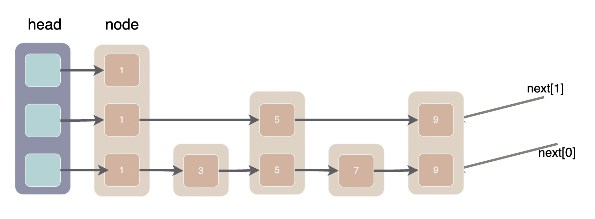
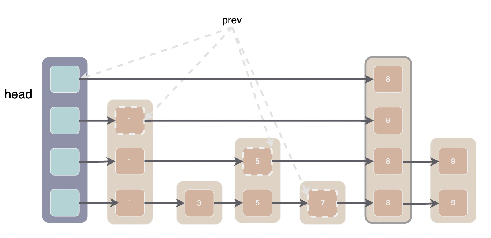
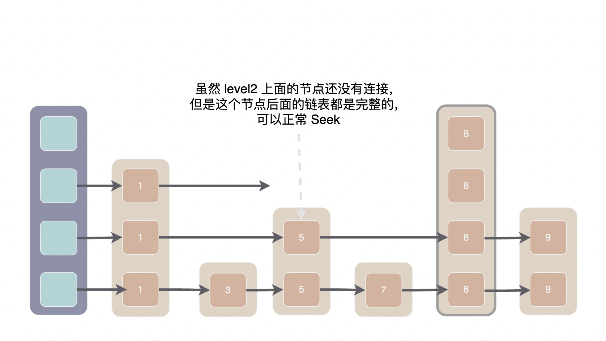

memtable 是一个内存中的有序 map 结构，它的底层实现是一个跳表。本文将介绍 memtable 及其底层跳表的实现。

> 源码传送门：[memtable.h](../db/memtable.h)/[memtable.cc](../db/memtable.cc)
> 这个是跳表 [skiplist.h](../db/skiplist.h)

**memtable 使用 [InternalKey](./02-基本工具类.md#internalkey) 作为键类型**。由于 InternalKey 中包含 UserKey 和唯一的 SequenceNumber, 所以在同一个 Memtable 中可以容纳对同一个 UserKey 多个版本的数据。由于 memtale 使用 InternalKeyComparator 对 InternalKey 进行排序使相同的 UserKey 中 SequenceNumber 最大的排在第一位，所以我们可以迅速的找到某个 key 的最新值。

与 sstable 一样，**memtable 只能添加键值对不能修改或删除键值对**。

MemTable 底层的跳表在读取时是并发安全的，但写入时必须加锁。特别的，在写入同时可以进行读取操作。也就是说，允许*多线程同时读*或者*一个线程写同时有多个线程读*，只*禁止多线程同时写*。
## 数据结构

跳表节点的定义在 skiplist.h 中搜索 `struct SkipList<Key, Comparator>::Node` 即可找到，它只有两个字段:

```cpp
struct Node {
    // key 字段存储了上层要储存的数据
    Key const key; 
    // next 字段是一个与 Node 实际层数相同的数组
    // 记录了各层的 next 指针, next_[0] 是
    std::atomic<Node*> next_[1]; 
}
```

> 由于 leveldb 的跳表不支持删除所以不需要 prev 指针，不需要支持排名功能也不需要步长 span, 比 redis 的跳表简单多了

skiplist 中只有 3 个字段需要关注：

```cpp
class Skiplist {
  Arena* const arena_; // 内存池，具体等到 Add 的时候再看
  Node* const head_; // 头指针，没什么好说的
  std::atomic<int> max_height_; // 跳表的实际高度
}
```

## Get

```cpp
// LookupKey 由 UserKey 和 SequenceNumber 组成
// 找到的值会存在 *value 中，同时 *s 会被设为 ok, 返回 true
// 若值没有找到 *s 会被设为 NotFound 并返回 true, 只有遇到错误时才会返回 false
bool MemTable::Get(const LookupKey& key, std::string* value, Status* s) {
  Slice memkey = key.memtable_key(); 
  Table::Iterator iter(&table_);
  // seek 会定位到第一个大于等于 LookupKey 的节点上
  // 所以，若跳表中不包含 UserKey，iter 此时指向大于 UserKey 的第一个节点
  // 若跳表中包含 UserKey, 由于 InternalKeyComparator 按照 SequenceNumber 降序排列，所以 iter 此时指向序列号不超过 LookupKey.SequenceNumber 的最大节点
  iter.Seek(memkey.data()); 
  if (iter.Valid()) {
     const char* entry = iter.key();
     // 省略一些解码操作
     switch (static_cast<ValueType>(tag & 0xff)) {
        case kTypeValue: {
          value->assign(v.data(), v.size());
          return true;
        }
        case kTypeDeletion:
          *s = Status::NotFound(Slice());
          return true;
      }
  }
}
```

memtable 底层使用的跳表只有一个字段可以存储数据, 因此 memtable 必须将 key 和 value 编码在一起。具体编码格式为：

1. key_size: varint32 编码的 internal_key 长度
2. internal_key 内容
3. tag: 包含 SequenceNumber 和 type，具体方式为 uint64((sequence << 8) | type)
4. value_size: varint32 编码的 value 长度
5. value 内容

接下来看重点，跳表的实现：

```cpp
inline void SkipList<Key, Comparator>::Iterator::Seek(const Key& target) {
  node_ = list_->FindGreaterOrEqual(target, nullptr);
}

Node* SkipList::FindGreaterOrEqual(const Key& key,
                                              Node** prev) const {
  Node* x = head_;
  int level = GetMaxHeight() - 1;
  while (true) {
    Node* next = x->Next(level);
    if (KeyIsAfterNode(key, next)) { // key > next
      // 在当前层级中继续寻找
      x = next;
    } else {
      // next >= key, 准备去下一个层级寻找
      if (prev != nullptr) prev[level] = x; // 将当前层级的前驱节点存在 prev 中
      if (level == 0) {
        return next;
      } else {
        // 去下一个层级
        level--;
      }
    }
  }
}
```

Seek 函数的核心是 FindGreaterOrEqual，它返回大于等于 key 的一个节点的指针，并将它的在各层的前驱指针存储在 prev 数组中。

FindGreaterOrEqual 并不复杂，熟悉跳表的同学现在应该看懂了。看不懂也没关系我们来画一张图。



上面是一个跳表的示意图，大方块就是跳表的 Node, Node 内部的小方块就是它的一个 next 指针，里面的数字是 node 的 key。可以很明显的看出，现在的跳表就是三个单链表组成的。

我们模拟一下在上面的跳表中寻找节点 7 的过程，FindGreaterOrEqual 中有两个游标 x 和 level, 首先从最高层开始，遍历本层链表直到 x.next 大于等于 key 时进入下一层，直到在 level0 找到 key 或确认 key 不存在。

1. 第1次循环 x=head，level=2，next=节点1。next < key, 令 x = next 在本层中继续寻找 
2. 第2次循环 x=节点1，level=2，next=null。null 大于任意 key, 进入下一层，同时令 prev[2]=节点1
3. 第3次循环 x=节点1，level=1，next=节点5。next < key, 令 x = next 在本层中继续寻找 
4. 第4次循环 x=节点5，level=1, next=节点9。next > key, 进入下一层，令 prev[1]=节点5
5. 第5次循环 x=节点5，level=0, next=节点7. next == key, 令 prev[0]=节点5，level==0 找到节点 7


## Add

上文提到底层的跳表只有一个字段可以存储数据，所以 memtable 必须将 key 和 value 编码在一起，MemTable::Add 函数具体负责这一编码工作。源码比较简单，这里就不贴全了，感兴趣的朋友可以通过[传送门](../db/memtable.cc)去阅读。

这里需要提两点：

- 编码的 buffer 是在 MemTable 的 arena_ 上分配的。arena_ 的生命周期与 MemTable 相同，由于 Memtable 的最大内存为 4MB, 所以 arena_ 可分配的内存大小同样是 4MB


- 底层的跳表不允许插入重复数据，但是 Memtable 插入的 record 中包含全局唯一的 InternalKey 所以实际上不会重复

> arena 的介绍在这里 [02-基本工具类](./02-基本工具类.md#arena)

```cpp
void MemTable::Add(SequenceNumber s, ValueType type, const Slice& key,
                   const Slice& value) {
    // 编码的 buffer 是在 MemTable 的 arena_ 上分配的
    char* buf = arena_.Allocate(encoded_len);
    // 省略一些向 buffer 中写数据的代码
    char* p = EncodeVarint32(buf, internal_key_size);
    std::memcpy(p, key.data(), key_size);
    // table_ 是 MemTable 底层的跳表
    // 另外可以注意到 table_.Insert 只接受一个参数
    table_.Insert(buf); // 将键值对插入跳表中
}
```

接下来直接看跳表的 Insert 实现:

```cpp
void SkipList<Key, Comparator>::Insert(const Key& key) {
  // 第一步：使用 FindGreaterOrEqual 返回的 prev 数组作为各层插入时的前驱节点
  Node* prev[kMaxHeight];
  Node* x = FindGreaterOrEqual(key, prev);
  // 第二步：随机选择新节点高度，如果新节点的高度超过了原来跳表的最大高度则进行相关的处理
  int height = RandomHeight();
  if (height > GetMaxHeight()) {
    // 如果新节点的高度超过了原来的最大高度，新增的层数以 head 作为前驱
    for (int i = GetMaxHeight(); i < height; i++) {
      prev[i] = head_;
    }
    // 更新跳表的实际最大高度
    max_height_.store(height, std::memory_order_relaxed);
  }
  // 第三步：将新节点添加到 prev 后面，经典的单链表插入
  x = NewNode(key, height);
  for (int i = 0; i < height; i++) {
    // 新节点 x 此时还没有加入链表，无法被访问到，所以在无锁的情况下 SetNext 是安全的
    x->NoBarrier_SetNext(i, prev[i]->NoBarrier_Next(i));
    // 把 x 加入到链表中就需要锁了
    prev[i]->SetNext(i, x);
  }
}
```

第一步的 FindGreaterOrEqual 我们在讨论 Get 的时候已经讲过了。下图说明了在跳表中插入一个高度为 4 的节点 8 的操作，prev 数组已经标出，应该不需要多解释。



最后我们再来讨论一下跳表的并发安全问题，不能并发写入以及可以并发读取都很好理解，那么为什么可以在写入时读取呢。

Add 函数写入由两处：一是修改 max_height, 二是向 prev 后面插入新节点。

我们注意到 Add 函数在修改 max_height 时采用的是 memory_order_relaxed，同时执行的 Get 函数可能读到新的 height 也可能读到旧的 height。

如果读到旧的 height 自然是安全的，如果读到新的 height, 那么读线程可能碰到 len(head.next_) < max_height 的情况，此时将 `head.next_[max_height-1]` 当做 null 处理即可。

第二种可能遇到的奇怪情况是，写线程正在插入新节点，读线程整好遍历到 prev 数组的某个节点。

我们注意到**插入的顺序和读取的顺序正好是相反的**，读取自顶向下而插入自底向上。而且先连接新节点后面的节点，再将新节点接入到 prev 后面。也就是说，当写线程原子性的执行了 `prev[i]->SetNext(i, x);` 之后，第 i 层 x 节点之后要读取的跳表都是完整的，读线程可以正常 Seek。



