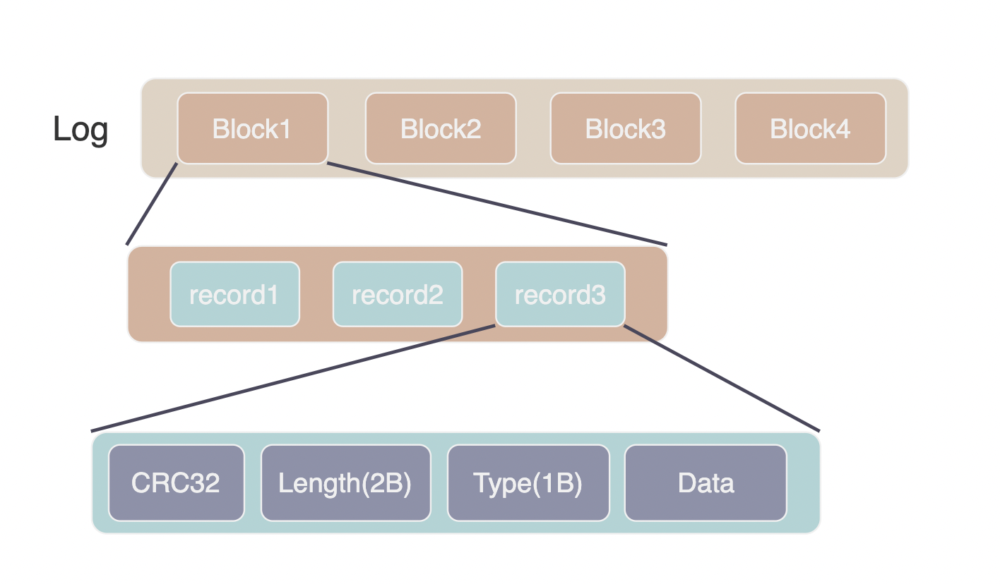
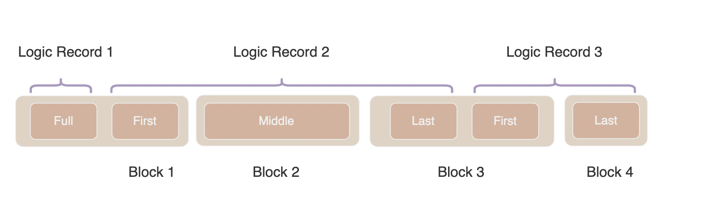

leveldb 的写操作并不是直接写入磁盘的，而是首先写入到内存中的 memtable 。假设写入到内存的数据还未来得及持久化，leveldb 崩溃抑或是宿主机器发生了宕机则会造成用户的写入发生丢失。因此 leveldb 在写内存之前会首先将所有的写操作写到 log 文件(这种 log 通常被称为 Write Ahead Logging, WAL)中，在出现异常后根据 log 文件进行恢复。

## log 的结构

level db 日志文件由一系列 32KB 的块（Block）组成。每个 Block由一系列记录（Record）组成，Record 的结构为：

- checksum: type 和 data 字段的 crc32 校验和，小端序
- length: uint16 小端序
- type: uint8
- data

总结一下，Log 的结构如下图所示：



Record 有四种 type:

- FULL: 1
- FIRST: 2
- MIDDLE: 3
- LAST: 4

如果某个 Record 记录了完整的内容，那么它的类型为 FULL. 如果由于 Block 空间不足等原因，需要将用户的内容分成多个 Record, 第一个 Record 类型为 FIRST, 最后一个 Record 的类型为 LAST, 如果需要更多 Record 则在中间添加若干类型为 MIDDLE 的 Record. LAST 中可能包含 trailer.



一个 Record 的头部有 7 个字节： CRC 4Byte + Length 2Byte + Type 1B。leveldb 不允许block 中出现头部不完整的 record, 所以当 Block 剩余的字节数不足 7 个时便使用 0 来填充，这样做可以大幅简化读取逻辑。

log 的写入由 [log_writter.cc](../db/log_writer.cc) 负责, 基本上是在做拆分。

```cpp
Status Writer::AddRecord(const Slice& slice) {
    const char* ptr = slice.data();
    size_t left = slice.size(); // left 表示还有多少用户数据需要写入
     Status s;
    bool begin = true;
    // 尝试将数据分成多个 Record, 每次循环写入一个分段直至完全写入
     do {
        const int leftover = kBlockSize - block_offset_; // 计算 Block 中剩余的空间
        if (leftover < kHeaderSize) { // 小于 7 个字节，放不下一个 record, 将其填充
        // Switch to a new block
        if (leftover > 0) {
            // 填充 0 值
            dest_->Append(Slice("\x00\x00\x00\x00\x00\x00", leftover));
        }
        // 切换到新的 block, 重置 block_offset_
        block_offset_ = 0;
    }
  
    // 计算 Block 中剩余多少空间可以存储用户数据
    const size_t avail = kBlockSize - block_offset_ - kHeaderSize; 
    // 判断是否需要分成多个片段，以及当前分段的大小
    const size_t fragment_length = (left < avail) ? left : avail;

    // 计算 RecordType
    RecordType type;
    const bool end = (left == fragment_length); 
    if (begin && end) {
      type = kFullType;
    } else if (begin) {
      type = kFirstType;
    } else if (end) {
      type = kLastType;
    } else {
      type = kMiddleType;
    }
    // EmitPhysicalRecord 实际写入 Record 
    s = EmitPhysicalRecord(type, ptr, fragment_length);
    ptr += fragment_length;
    left -= fragment_length;
    begin = false;
  } while (s.ok() && left > 0);
}
```

Log 的读取由 [log_reader.cc](../db/log_reader.cc) 负责，主要函数是 ReadRecord。由于是顺序读取，我们已经在源码中做了详细的注释，这里就不贴出来了。

WAL 文件与 Memtable 是对应的。每当 memtable 写满转换为 immutable 后，leveldb 就不再写入原来的 WAL 而是创建新的 memtable 和新的 WAL 文件，新 memtable 的写入会记录在新的 WAL 中。

为了防止 WAL 无限制增长，leveldb 会在必要时进行清理。当完成 Minor Compaction 之后，Immutable Mmetable 已经被持久化至硬盘中，leveldb 便会清理相应的 WAL。此外，在 leveldb 启动以及 major compaction 完成后都会进行 WAL 清理工作。