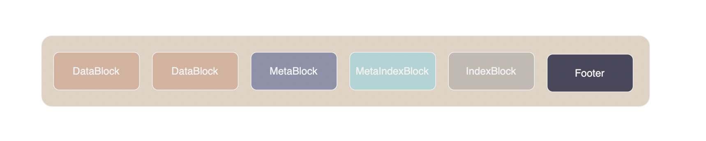
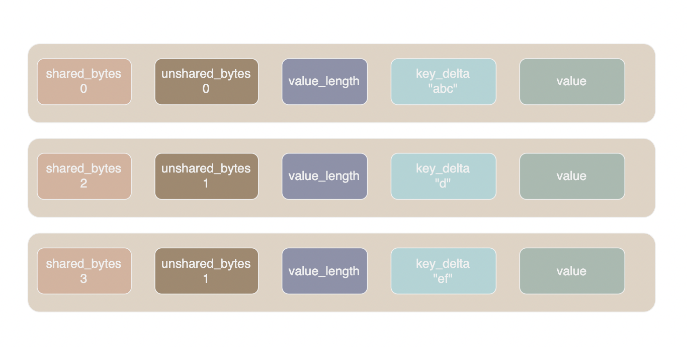
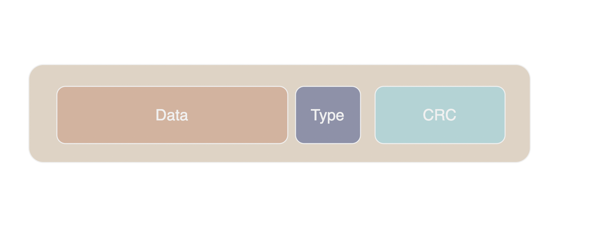
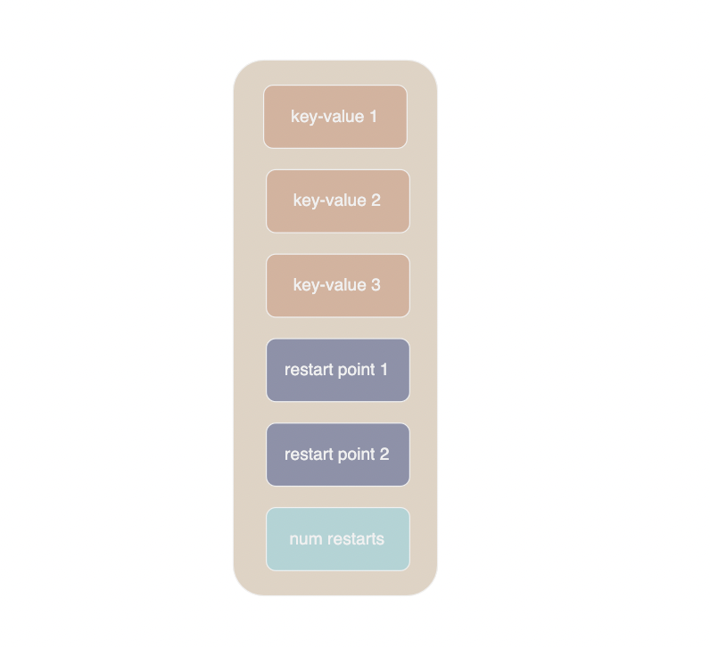
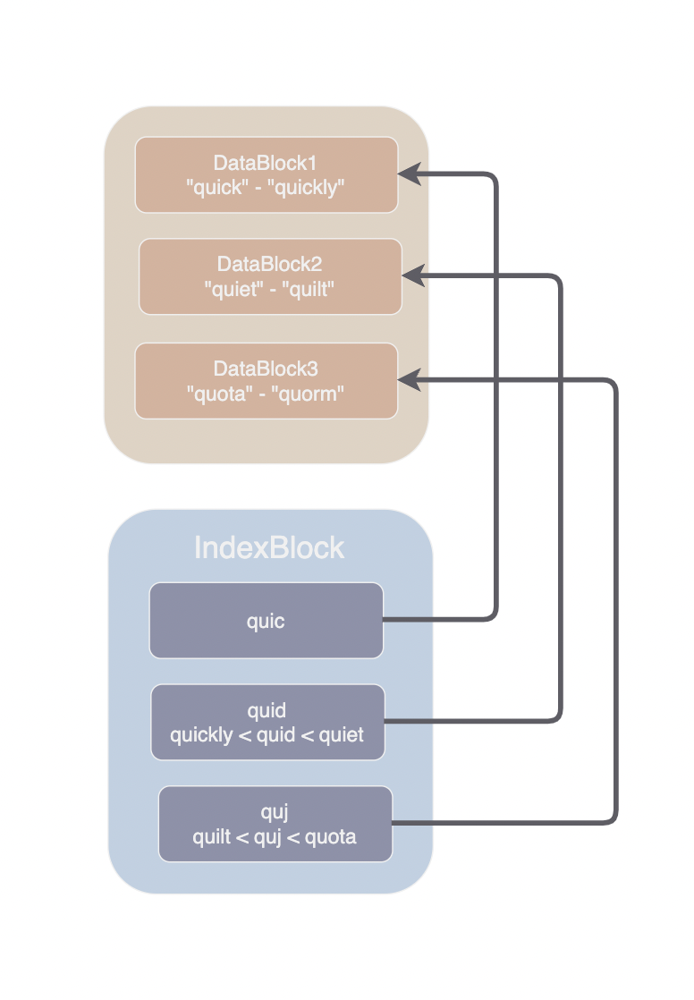
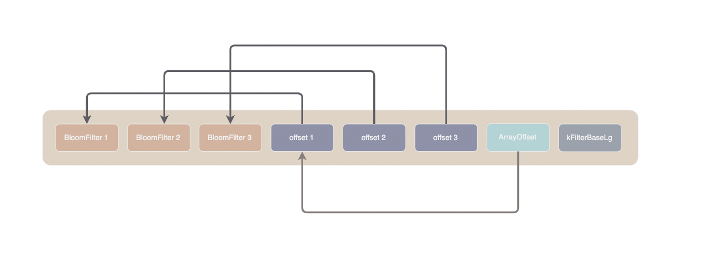

SSTable (Sorted String Table) 是负责将数据持久化存储在磁盘上的结构，本文将介绍 SSTable 的结构以及相关的源码。

## Table基本结构



如上图所示，一个 sstable 中包含若干个 DataBlock、若干个 MetaBlock、一个 IndexBlock、一个 MetaIndexBlock 以及 Footer.

DataBlock 是实际存储键值对数据的 Block, IndexBlock 中存储了每个 DataBlock 中的 key range 信息和指针，便于读取时使用二分查找迅速找到 key 所在的 DataBlock。 

Meta 块中存储了各类元信息，目前版本主要是 BloomFilter 数据，用于在进入 DataBlock 查找前迅速判断  sstable 中是否包含某个 key。 MetaIndexBlock 与 IndexBlock 类似，只是其中存储的是 MetaBlock 的信息。

sstable 中使用 BlockHandle 类型作为 Block 的指针，其中包含 offset 和 size 两个字段，这两个字段均使用 varint64 编码。
### Footer

sstable 文件最后 48 个字节为固定结构的 Footer, Footer 中保存了 Metaindex 和 Index 块的指针。读取 sstable 时总是先读取 Footer 获得 Metaindex 和 Index 块的指针，然后从 Metaindex 和 Index 块中找到对应的 Meta 块和 Data 块。

```
metaindex_handle: char[p];     // metaindex 块的指针（BlockHandle）
index_handle:     char[q];     // index 块的指针（BlockHandle）
padding:          char[40-p-q];// 填充的 0 值
                               
magic:            fixed64;     // == 0xdb4775248b80fb57 (little-endian)
```

### RestartPoints

由于 Data Block 中的 key 是有序存储的，这意味着相邻的 key 很可能拥有相同的前缀，如果能够复用前缀可以极大的减少存储空间，

于是 leveldb 中定义两种存储 key 的方式用以压缩存储前缀，一种是重启点(restart point) 它们存储了完整的 key 不复用前缀；另一种普通的 key 则会复用它前面一个 key 的前缀。

DataBlock 中一个键值对的格式如下：

- shared_bytes: varint32 共享前缀长度，对于重启点来说 shared_bytes 始终为 0
- non_shared_bytes: varint32 前缀之后 key 的长度
- value_length: varint32 value 的长度
- key_delta: char[non_shared_bytes] key 在复用前缀之后的部分
- value: char[value_length] 



restart points 如上图所示：
- 第一行是一个重启点
- 第二行复用了上一条记录的两个字节 "ab" 前缀，加上自己的 key_delta: "d", 这条记录的 key 是 "abd"  
- 第三行复用了上一条记录的 3 个字节 "abd" 前缀，加上自己的 key_delta: "ef", 这条记录的 key 是 "abdef" 

### DataBlock

Data Block 由 block data、 type crc32 三部分组成。1 个字节的 type 表明采用的压缩方式，目前有 none 和 snappy 两种。



其中的 Data 块内部结构如下：



DataBlock 的结尾部分存储了其中每个重启点的 offset，在查找某个 key 时可以采用二分查找的方法搜索最近的重启点，然后向后遍历寻找目标。

如果两个两个重启点之间键值对过多，那么查询时就会读取过多的记录，拖慢查询性能。  Options::block_restart_interval 选项可以规定每隔几个 key 必须有一个重启点，用于平衡压缩率和查询性能。

### IndexBlock

IndexBlock 以键值对的格式索引 DataBlock, key 是一个小于 DataBlock 中第一个 key 的字符串，value 是指向 DataBlock 的 BlockHandle。IndexBlock 的内部格式与 DataBlock 完全相同，两者都使用同一个 BlockBuilder 类进行构造。



如上图所示，指向 DataBlock2 的 index key 为 quid，quid 大于上一个 block 最后一个键 quickl，小于 DataBlock2 的第一个键 quiet。IndexBlock 中的 key 由 [InternalKeyComparator::FindShortestSeparator](../db/dbformat.cc) 函数来确定。

### MetaIndexBlock

MetaIndexBlock 与 IndexBlock 非常类似，MetaIndexBlock以键值对的格式存储了所有 Meta Block 的位置，key 为 MetaBlock 的名字，value 为 BlockHandle. 

目前的 MetaBlock 只有一条指向 FilterBlock 的记录，它的key为 `filter.<filter_name>`, filter_name 在 Options::FilterPolicy 中确定。

### FilterBlock

如果在打开数据库时指定了 [FilterPolicy](../include/leveldb/filter_policy.h) 则在 table 文件中会产生相应的 filter 块，在查询时可以根据 Filter 迅速判断 sstable 中是否包含某个 key。leveldb 中内置了 [BloomFilter](../util/bloom.cc) 的实现。

leveldb 的 FilterBlock 采用分治策略每 2KB 数据建立一个 Filter, FilterBlock 的结构如下图所示：



FilterBlock 最前面是若干块 Filter 数据，紧随其后的是与各块 Filter 一一对应的 offset 记录各块的起始位置，offset 采用 fixed32 编码。offsets 后面是 Fixed32 编码的 array_offset 字段记录了 offsets 数组的起始位置。

FilterBlock 最后是 kFilterBaseLg，每过 2^kFilterBaseLg 个字节即构建一个 Filter, 其值在源码中写死：

```cpp
// 每过 2KB 数据构建一个 Filter
static const size_t kFilterBaseLg = 11;
static const size_t kFilterBase = 1 << kFilterBaseLg;
```
