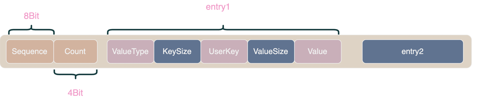
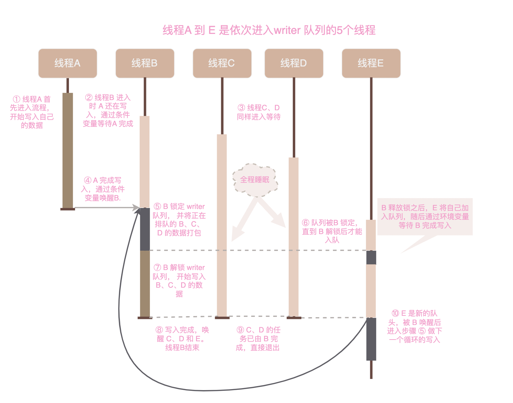

# 写入流程

在前面的几篇文章中我们已经讨论了 leveldb 中三个重要组件：MemTable、Log 以及 SSTable，从本文开始我们将开始探究 leveldb 核心流程。

[include/leveldb/db.h](../include/leveldb/db.h) 中的 DB 类定义了 leveldb 对外暴露的接口，它的实现代码在 [db/db_impl.cc](../db/db_impl.cc), 而 db_impl.cc 也是 leveldb 的核心所在。

在了解 leveldb 如何组织数据之前很难看懂读取逻辑，所以我们先从写逻辑入手, 看看 leveldb 如何组织数据。

## WriteBatch

写流程的入口在 DB::Put 函数中：

```cpp
// Convenience methods
Status DBImpl::Put(const WriteOptions& o, const Slice& key, const Slice& val) {
  return DB::Put(o, key, val);
}

Status DB::Put(const WriteOptions& opt, const Slice& key, const Slice& value) {
  WriteBatch batch;
  batch.Put(key, value);
  return Write(opt, &batch);
}

Status DBImpl::Write(const WriteOptions& options, WriteBatch* updates);
```

在上面的代码中我们注意到写入过程实际是由 DB::Write 函数执行的，DB::Put 只是它的快捷方式。而 DB::Write 写入的并不是一个键值对而是 WriteBatch。

WriteBatch 是一个写事务，它将一串写操作包装在一起，由 Write 函数原子性的写入。

> 源码传送门 [WriteBatch.h](../include/write_batch.h)/[WriteBatch.cc](../db/write_batch.cc)

由于 leveldb 采用新版本键值对覆盖旧版本的方式进行更新和删除，所以 WriteBatch 中直接存储了新版本的键值对。



WriteBatch 中的键值对经过编码后存储在 string 类型的 rep_ 字段中, 上图展示了 WriteBatch 编码的结构。开头的 8 位是用于 MVCC 的 SequenceNumber，接下来的 4bit 以 FixedUint32 编码存储 WriteBatch 中键值对的数量。

键值对编码由 KeySize、UserKey、ValueSize、Value 四部分组成，KeySize 和 ValueSize 采用 varint 编码记录 UserKey 和 Value 的长度。

我们在[02-工具类](02-utils.md#internalkey) 中简单介绍过 SequenceNumber，它是一个递增的全局序列号，用于实现多版本并发控制(MVCC)。每个 WriteBatch 都会拥有一个唯一的 SequenceNumber，在写入时 SequenceNumber 会存储在键值对的 InternalKey 中。读事务会先获得当前的序列号然后只读取序列号更小的键值对，这样在读事务开始后的写入便不会被看到。

## DBImpl::Write

DBImpl::Write 函数负责实际的写入工作，它的代码极其复杂我们分开来看。

### writers队列

leveldb 写入操作的固定开销很大，说白话就是一次写入十个 WriteBatch 的耗时远小于分十次每次写入一 WriteBatch。为了提高性能，Write 函数引入了 writers 队列将多个 WriteBatch 一次性写入。

writers 的代码并不容易读懂，我们先画个时序图再来看代码：



```cpp
Status DBImpl::Write(const WriteOptions& options, WriteBatch* updates) {
  // 创建一个 writer
  // Writer 在多线程间协调时代表一个线程
  Writer w(&mutex_); 
  MutexLock l(&mutex_);  
  // 将代表自己的 writer 加入到队列
  writers_.push_back(&w);
  // 如果自己不是队列中第一个 writer 则通过条件变量 w.cv 等待 w.done 变为 true
  while (!w.done && &w != writers_.front()) {
    // 条件变量 CondVar 的 Wait 方法会暂时释放锁，然后阻塞当前线程
    // 在 Wait 期间，其它线程可以拿到锁，并在完成操作后将等待中的线程唤醒
    // 被唤醒的线程将重新拿回锁
    w.cv.Wait(); 
  }
  // 能通过 while 进入这里的线程有两种情况：
  // 1. 自己就是队列头，需要负责写入
  // 2. 自己的数据已被其它线程写入，直接退出就好
  //
  // 所有进入此处的线程都持有锁
  if (w.done) { 
    // 返回后 MutexLock 析构，自动释放锁
    return w.status;
  }
  
  // 将队列中所有等待的 writer 打包成一个 write_batch
  // 此时当前线程持有 mutex_, 其它线程无法入队
   WriteBatch* write_batch = BuildBatchGroup(&last_writer);
      
  // 解锁之后，在当前线程写入期间其它线程就可以将自己的 writer 入队了
  mutex_.Unlock(); 
  
  // 此处省略三百行实际写入流程代码

  // 写入完成，通过条件变量唤醒那些工作已被自己代劳的线程
  while (true) {
    Writer* ready = writers_.front();
    writers_.pop_front();
    if (ready != &w) {
      ready->status = status;
      ready->done = true;
      ready->cv.Signal();
    }
    if (ready == last_writer) break;
  }
  // 唤醒队列中排在后面的第一个 writer 进行下一次写入
   // Notify new head of write queue
  if (!writers_.empty()) {
    writers_.front()->cv.Signal();
  }
}
```

### 准备写入MakeRoomForWrite

在阅读写入代码前我们先来复习一下在概述中讨论过的 leveldb 结构：


键值对会首先被插入到 memtable 中，当 memtable 大小达到阈值 4MB 时，会被转变为不可写入的 immutable memtable。immutable memtable 会被尽快持久化到 level0, level0 写满后也需要尽快沉入下层。

DB::Write 在正式开始写入前便会调用 DBImpl::MakeRoomForWrite 函数来负责 memtable 转为 immutable、immutable memtable 持久化等工作，当 DBImpl::MakeRoomForWrite 返回时可以确保 memtable 中有空间存储新数据。

```cpp
// 进行写入前检查, 若当前数据库状态不适合写入则会循环等待直至可以写入（等待后台 compaction 完成就可以写入了）
// MakeRoomForWrite 返回时 Memtable 一定有空间，且 level 0 的 sstable 极大概率小于 8 
//
// 检查的内容包括：
//   1. 检查 level0 的 sstable 数量是否达到了 kL0_SlowdownWritesTrigger (默认为8)， 如果是则 sleep 1ms 以减慢写入速度，给 compaction 留下时间
//   2. 检查 mutable MemTable 是否达到了最大值 （write_buffer_size，默认4MB）, 如果未达到直接写入 Memtable
//   3. 若 Memtable 已经达到最大值，且 immutable Memtable 尚未持久化，则等待 compaction 完成
//   4. 检查 level0 的 sstable 数量是否达到了 kL0_StopWritesTrigger (默认为12)， 如果是则等待 compaction 完成
//   5. 若 Memtable 已经达到最大值，且没有 immutable Memtable 则将当前 Memtable 转变为 immutable， 创建一个新的 mutable Memtable，并触发一次 minor compaction
Status DBImpl::MakeRoomForWrite(bool force) {
    bool allow_delay = !force;
    while (true) { // 整个函数是一个忙等待的模式
        if (versions_->NumLevelFiles(0) >=
                                    config::kL0_SlowdownWritesTrigger) {
            // 检查 level0 的 sstable 数量是否达到了 kL0_SlowdownWritesTrigger (默认为8)， 如果是则 sleep 1ms 以减慢写入速度，给 compaction 留下时间
            // level0 有 4 个 sstable 时开始 compaction, 当有 8 个 sstable 时则会减慢写入速度，当有 12 个 sstable 时则必须停下来等待 compaction 完成
            // 减速写入是因为我们认为多次写入延迟 1ms 比单次写入延迟几秒要好，这样不仅使写入耗时比较稳定，也可以让出部分 CPU 给 compaction 使用
            mutex_.Unlock();
            env_->SleepForMicroseconds(1000);
            allow_delay = false;  // 最多 sleep 一次
            mutex_.Lock();
        } else if (!force &&
               (mem_->ApproximateMemoryUsage() <= options_.write_buffer_size)) {
            // 如果 Memtable 中仍有空间，允许写入
            break;
        } else if (imm_ != nullptr) {
            // 当前 Memtable 已满且上一个 memtable 尚未存盘，等待后台线程完成 immutable 存盘
            background_work_finished_signal_.Wait();
        } else if (versions_->NumLevelFiles(0) >=
                       config::kL0_StopWritesTrigger) {
            // level0 的 sstable 数量达到了 kL0_StopWritesTrigger (默认为12)，必须停止写入等待 compaction 完成
            background_work_finished_signal_.Wait();
        } else {
            // memtable 已经达到最大值，且没有 immutable Memtable 则将当前 memtable 
            // 转变为 immutable, 创建一个新的 mutable Memtable，并开启后台任务将 immutable 持久化到 level0

            // 当新的 memtable 取代已变为 immutable 的旧 memtable 时，也会创建一个新的 WAL
            // 也就是说 WAL 日志文件和 table 是一一对应的
            env_->NewWritableFile(LogFileName(dbname_, new_log_number), &lfile);
            delete log_;
            s = logfile_->Close();
            logfile_ = lfile;
            logfile_number_ = new_log_number;
            log_ = new log::Writer(lfile);

            // 将当前 Memtable 置为 immutable, 并创建一个新的 mutable MemTable
            imm_ = mem_; 
            has_imm_.store(true, std::memory_order_release);
            mem_ = new MemTable(internal_comparator_);
            // 触发 immutable 持久化到 level0 的后台任务
            MaybeScheduleCompaction();
        }
    }
}
```

OK, 虽然这代码巨长，但是并不难理解。

上面代码中有个细节可能被忽视，这里单独拿出来说一下： 当新的 memtable 取代已变为 immutable 的旧 memtable 时，也会创建一个新的 WAL 文件，也就是说 WAL 日志文件和 table 是一一对应的。

### Write整体流程

现在我们就可以拼出 Write 函数的整体流程了：

```cpp
Status DBImpl::Write(const WriteOptions& options, WriteBatch* updates) {
    // STEP1: 将代表自己的 writer 加入到队列, 并等待被唤醒
    writers_.push_back(&w);
    while (!w.done && &w != writers_.front()) {
        w.cv.Wait(); 
    }
    if (w.done) { // 其它线程替自己完成了写入，退出
        return w.status;
    }

    // 如果自己被唤醒负责写入
    // STEP2: 将队列中所有正在等待的线程的任务打包成一个 write_batch
    WriteBatch* write_batch = BuildBatchGroup(&last_writer);
      
    // 解锁队列，在当前线程写入期间允许其它线程就将自己的 writer 入队了
    mutex_.Unlock(); 
  
    // STEP3: 等待数据库状态允许写入
    Status status = MakeRoomForWrite(updates == nullptr);

    // STEP4: 写入 WAL 日志
    log_->AddRecord(WriteBatchInternal::Contents(write_batch));

    // STEP5: 写入 MemTable
    WriteBatchInternal::InsertInto(write_batch, mem_);

    // STEP6: 更新最新的序列号
    versions_->SetLastSequence(last_sequence);
  
    // STEP7: 唤醒被自己代劳的其它线程
    while (true) {
        Writer* ready = writers_.front();
        writers_.pop_front();
        if (ready != &w) {
            ready->status = status;
            ready->done = true;
            ready->cv.Signal();
        }
        if (ready == last_writer) break;
    }
    
    // STEP8: 唤醒新的队头 writer 负责下一次写入
    if (!writers_.empty()) {
        writers_.front()->cv.Signal();
    }
}
```

## 总结

作为介绍 leveldb 核心流程的文章，本文的内容略显零散，我们不妨总结一下。

1. leveldb 以写事务 WriteBatch 为单元进行写入，每个 WriteBatch 拥有一个唯一的递增序列号 SequenceNumber 用于 MVCC 机制。
2. DB::Write 函数负责写入流程，它引入 writers 队列将多个小 WriteBatch 合并为一个大 Batch 一次性写入，从而减少写入的固定开销。
3. 实际写入前会调用 DBImpl::MakeRoomForWrite 等待数据库状态适合写入。具体来说是指 memtable 有空间容纳新的数据、immutable memtable 正在被尽快持久化到 level0、level0 未满可以容纳新的 immutable memtable 落盘。
4. DB::Write 函数整体流程可以分为：进入 writers 队列等待被唤醒、通过 MakeRoomForWrite 确保数据库状态可以写入、写 WAL、写 memtable、更新序列号、唤醒下一个队头 writer 开始新一轮写入