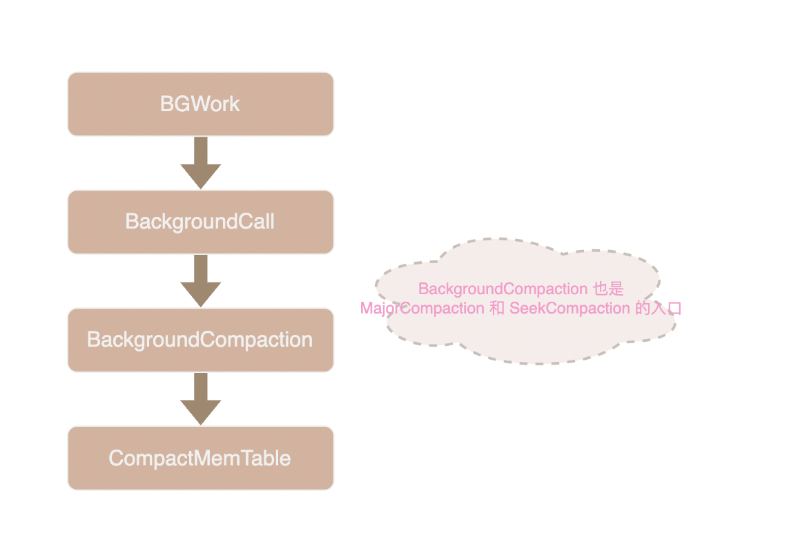

# MinorCompaction

## Compaction 概述

leveldb 采用写入新版本键值对覆盖旧版本的方式进行更新和删除，这意味着虽然一个 key 只有最新的几个版本可以被读到，但是所有的历史版本都会堆积在磁盘上。


为了避免这些无用的旧版数据浪费宝贵的磁盘空间，leveldb 会采取一些措施来清除无用的数据， 在 LSM (Log Structured-Merge Tree) 模型中这种清除无用数据的操作被称为 Compaction 或者 Merge。

leveldb 中有三种 compaction 算法:

- MinorCompaction 特指将 immutable memtable 持久化到磁盘的操作
- MajorCompaction 是指将 sstable 合并、沉入更下层的操作，它也是 leveldb 中最为关键的流程。在源码中 MajorCompaction 也被叫做 SizeCompaction 
- SeekCompaction 用于优化查询效率，我们会在后续说明读取流程的文章中详细介绍它。

除了减少磁盘空间浪费外 compaction 算法也必须要考虑如何优化读写性能，特别是读取时的性能。leveldb 采用分层的方式来管理 sstable，其主要目的便是为了提高读取效率。

immutable memtable 持久化产生的 sstable 主要存放在 Level0。在分析过 [MakeRoomForWrite](./07-WriteProcess.md#准备写入makeroomforwrite) 函数后我们发现 MinorCompaction 过程会阻塞 leveldb 的写入，所以必须尽快完成。

因此，我们没有时间整理 level0 中 sstable，这导致 level0 table 的内容是完全随机的，一个 key 可能出现在其中任意一个 table 中，在查询时必须搜索 level0 的每一个 table，这无疑严重拖慢了查找效率。

而更深层的 sstable 则是由后台线程将上一层的 sstable 合并而成，即 MajorCompaction 过程。由于 MajorCompaction 的快慢对读写的干扰较小，所以有时间整理 sstable 使得 level1 及更深层的 sstable 在层内有序排列且不重叠，在查找时每层只需要搜索一个 table 即可。

> 实际上 level1 不是绝对不重叠，在 MajorCompaction 部分我们会详细讨论

## MinorCompaction

DBImpl::MakeRoomForWrite 函数在将 memtable 设为不可变后会调用 MaybeScheduleCompaction 函数来尝试触发 MinorCompaction。

MaybeScheduleCompaction 会将 BGWork 函数加入到后台任务中，经过一系列调用最终来到 CompactMemTable 函数，由它来实际负责 MinorCompaction。



```cpp
void DBImpl::CompactMemTable() {
  // Save the contents of the memtable as a new Table
  VersionEdit edit;
  Version* base = versions_->current();
  Status s = WriteLevel0Table(imm_, &edit, base);

  if (s.ok()) {
    // Replace immutable memtable with the generated Table
    edit.SetPrevLogNumber(0);
    edit.SetLogNumber(logfile_number_);  // Earlier logs no longer needed
    s = versions_->LogAndApply(&edit, &mutex_);
    // Commit to the new state
    imm_->Unref();
    imm_ = nullptr;
    has_imm_.store(false, std::memory_order_release);
  }
}
```

不难看出，CompactMemTable 主要做了两件事：一是调用 WriteLevel0Table 将 imm_ 写入到磁盘，二是通过 versions_ 和 VersionEdit 提交了数据状态变化。

```cpp
Status DBImpl::WriteLevel0Table(MemTable* mem, VersionEdit* edit,
                                Version* base) {
  // 第一步： 将 Memtable 写入到 sstable 文件中
  FileMetaData meta;
  meta.number = versions_->NewFileNumber();
  // 将新 table 加入到保护名单, 防止被垃圾清理线程误删
  pending_outputs_.insert(meta.number); 
  
  Iterator* iter = mem->NewIterator();
  Status s;
  {
    mutex_.Unlock();
    // 以 immutable MemTable 的 iter 作为数据源， 将数据持久化到 level0 
    // 由于要持久化的 MemTable 已经是不可变状态，所以不需要加锁了
    // BuildTable 函数负责操作我们熟悉的 TableBuilder 类，这里就不进去看了
    s = BuildTable(dbname_, env_, options_, table_cache_, iter, &meta); 
    mutex_.Lock();
  }
  delete iter;
  pending_outputs_.erase(meta.number);

  // Note that if file_size is zero, the file has been deleted and
  // should not be added to the manifest.
  int level = 0;
  if (s.ok() && meta.file_size > 0) {
    // 第二步：检查新 sstable 与各层 sstable 的重叠程度来决定放入哪一层
    const Slice min_user_key = meta.smallest.user_key();
    const Slice max_user_key = meta.largest.user_key();
    if (base != nullptr) {
      level = base->PickLevelForMemTableOutput(min_user_key, max_user_key);
    }
    // 第三步：通过 VersionEdit 将新的 sstable 加入到数据库的 manifest 中
    edit->AddFile(level, meta.number, meta.file_size, meta.smallest,
                  meta.largest);
  }

  return s;
}
```

整个过程分三步走：
1. 使用 TableBuilder 将 Memtable 持久化到 sstable 文件中
2. 检查新 sstable 与各层 sstable 的重叠程度来决定放入哪一层
3. 通过 VersionEdit 将新的 sstable 加入到数据库的 manifest 中

这个函数中唯一有些意外的地方是 imm_ 并不是一定放入 level0，如果新的 table 与深层中的 table 重叠部分不多，它也可能直接放入 level1 或 level2 中。具体放入哪一层由 [version_set.cc](../db/version_set.cc) 中的 PickLevelForMemTableOutput 函数决定。

简单来说决定层级的规则为：
1. 尽可能往深层放
2. new table 与 level0 和 level1 只要有重叠就放到 level0
3. new table 与 level N (N>=2) 如果重叠部分超过阈值就放到 level N-2, 未超过阈值就放到 level N-1。比如与 level 2 重叠超出阈值则放在 level0, 未超出则放在 level1

PickLevelForMemTableOutput