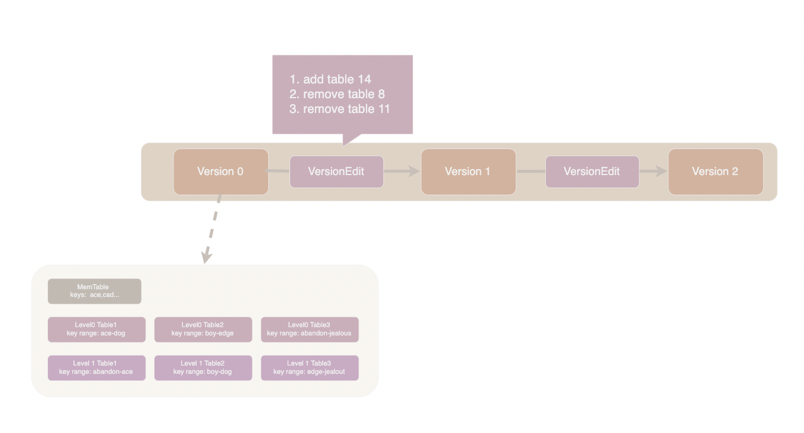
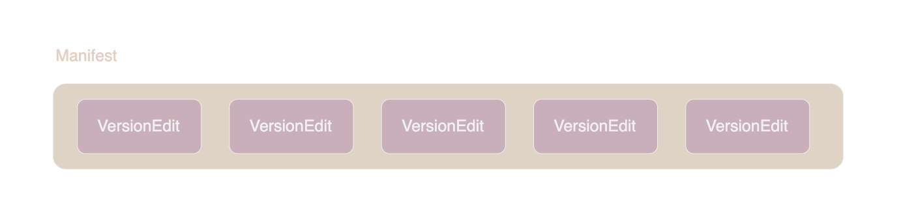

# Manifest & VersionSet

manifest 这个单词意为「货物清单」，leveldb 的 manifest 文件负责保存数据库中 sstable 的元信息，包括每层 table 的路径、key range、文件大小等。

每次 Compaction 操作都可能产生新的 sstable 或者删除旧的 sstable, leveldb 采用日志的方式来记录 manifest 的变化。



如上图所示，Version 类负责记录某个时刻 leveldb 中所有 sstable 的元信息，每当发生 Compaction 时便会产生一个 VersionEdit 对象记录 table 的变更。Version 中有指向上一个和下一个 Version 的指针，Version 的链表即组成了 VesionSet 对象。

VersionSet 会被持久化到 manifest 文件中。manifest 文件复用了 log 文件的结构，每次变更时都会将对应的 VersionEdit 对象序列化后追加到 manifest 文件尾部。Version 对象则仅存在于内存中，在 leveldb 启动时根据 manifest 文件重新构造出来。



由于每次启动都会新建一个 manifest 文件，因此 leveldb 中可能会存在多个 manifest 文件。因此需要一个额外的 current 文件来指示当前系统使用的到底是哪个 manifest 文件。current 文件中一个内容，即当前使用的manifest文件的文件名。

compaction 作为一个复杂操作可能遇到失败或者中断等意外，current 文件的另一个职责便是保持 manifest 变更的原子性。 当新的 manifest 文件名写入 current 之后 compaction 才算完成，在此之前任何异常都不会破坏数据完整性。

最后需要强调的一点是，Version、VersionSet、VersionEdit 负责 sstable 级别的版本控制，与 key-value 的版本没有关系。key-value 的版本控制，也就是我们熟悉的 MVCC (多版本并发控制)， 是由前面我们多次提到的 SequenceNumber 来负责的。

## 源码导读

sstable 的元信息由 FileMetaData 类负责保存，它的代码在 [version_.h](../db/version_edit.h) 中。

```cpp
struct FileMetaData {
  FileMetaData() : refs(0), allowed_seeks(1 << 30), file_size(0) {}

  int refs;  // 记录这个 sstable 被多少个 Version 引用
  int allowed_seeks;  // Seeks allowed until compaction. 这个字段在 SeekCompaction 部分再细究
  uint64_t number;  // 文件序号，用于确定文件名
  uint64_t file_size;   // 文件大小
  InternalKey smallest;  // table 中最小的 key
  InternalKey largest;   // table 中最大的 key
};
```

Version 和 VersionSet 的代码在 [version_set.h](../db/version_set.h)/[version_set.cc](../db/version_set.cc) 中。

```cpp
class Version {
  VersionSet* vset_;  // Version 所属 VersionSet 的指针
  // VersionSet 以链表的形式存储 Version, next_ 和 prev_ 是链表中指针
  Version* next_; 
  Version* prev_; 
  int refs_;  // Number of live refs to this version

  // 各层 sstable 的信息，FileMetaData 保存了一个 sstable 文件的元信息
  std::vector<FileMetaData*> files_[config::kNumLevels];

  // 根据 Seek 过程决定的下一次 Compaction 的目标 SSTable 及其 level
  FileMetaData* file_to_compact_;
  int file_to_compact_level_;
}
```

除了 Version 之外 VersionSet 中还存储了数据库级别的元信息，以后在源码中看到 versions_ 字段自动翻译成 db_metadata 就行😎。

```cpp
class VersionSet {
  Env* const env_;
  const std::string dbname_;
  const Options* const options_;
  TableCache* const table_cache_;
  const InternalKeyComparator icmp_;
  uint64_t next_file_number_;
  uint64_t manifest_file_number_;
  uint64_t last_sequence_;
  uint64_t log_number_;
  // 如果有 memtable 正在持久化，则 prev_log_number_ 中存储它的 WAL 日志文件编号
  // 没有正在进行的持久化时则为 0. 用于 leveldb 启动时恢复 VersionSet
  uint64_t prev_log_number_;  

  // Opened lazily
  // 当前的 Manifest 文件及其 writer
  WritableFile* descriptor_file_;
  log::Writer* descriptor_log_;
  // Version 双链表的头尾指针，注意这是个循环链表
  Version dummy_versions_;  // 循环链表的头指针， Head of circular doubly-linked list of versions. 
  // 注意 versions_.current_ 是最新 Version 对象的指针，不是 current 文件
  Version* current_;        // 循环链表的尾指针，== dummy_versions_.prev_ 
}
```

VersionSet::LogAndApply 函数负责提交新的 VersionEdit, 它主要做 4 件事：

1. 补全 edit 中 last_sequence、log_number_ 等字段
2. 根据 current version 和 edit 创建新的 version
3. 将 edit 数据写入 manifest 文件
4. 在 VersionSet 中更新 current version 信息

VersionSet 对象中 Manifest 文件相关的 descriptor_file_ 和 descriptor_log_ 字段是惰性初始化，也就是说在 VersionSet 首次调用 LogAndApply 才会打开。所以在 LogAndApply 中我们也能看到新建 manifest 文件的流程。